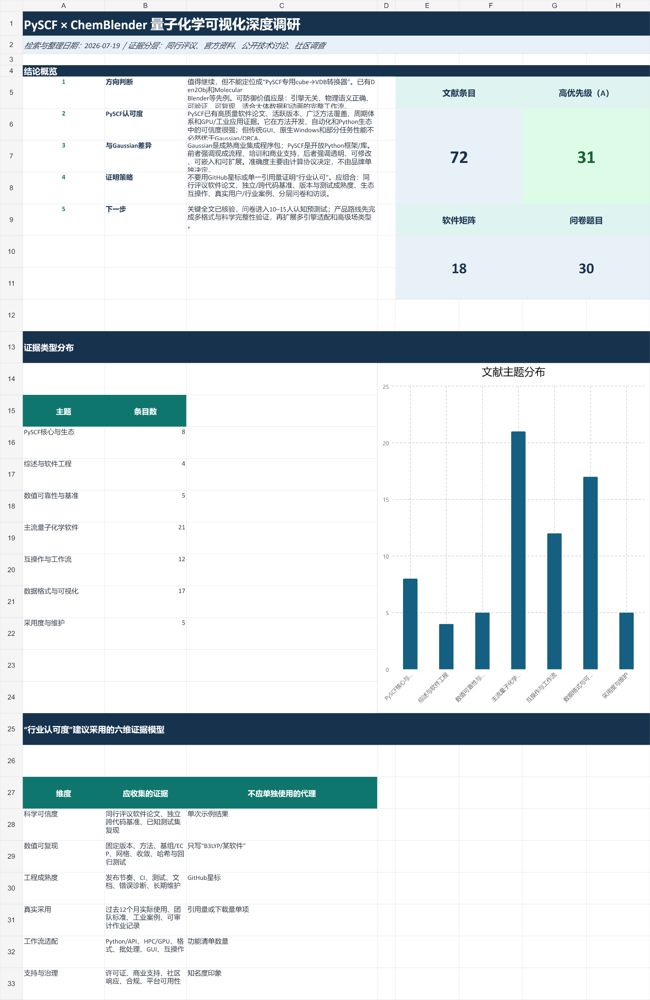

# PySCF × ChemBlender 量子化学可视化调研

本仓库整理了 PySCF、主流量子化学软件、多种量子化学场/波函数文件、OpenVDB / Blender 可视化工作流，以及软件采用度问卷设计的阶段性调研资料。检索与整理日期为 **2026-07-19**。

> 核心结论：该方向值得继续研究，但项目不宜只定位为“PySCF 专用 `.cube` → OpenVDB 转换器”。更有价值的方向是构建一个引擎无关、物理语义完整、可验证、可复现，并适合大规模稀疏体数据与时间序列的量子化学计算到 Blender 场景工作流。

## 仓库内容

| 文件 | 内容 | 建议用途 |
| --- | --- | --- |
| [`pyscf_quantum_chemistry_visualization_research_2026-07-19.md`](pyscf_quantum_chemistry_visualization_research_2026-07-19.md) | 中文深度调研报告 | 了解结论、证据边界、产品方向与验证方案 |
| [`pyscf_quantum_chemistry_visualization_research_2026-07-19.xlsx`](pyscf_quantum_chemistry_visualization_research_2026-07-19.xlsx) | 结构化调研工作簿 | 筛选文献、比较软件、整理问卷和验证任务 |
| [`pyscf_quantum_chemistry_literature_2026-07-19.bib`](pyscf_quantum_chemistry_literature_2026-07-19.bib) | BibTeX 文献库 | 导入 Zotero 等文献管理工具 |
| [`quantum_chemistry_software_survey_draft_2026-07-19.md`](quantum_chemistry_software_survey_draft_2026-07-19.md) | 文献支撑的量子化学软件采用与三维场可视化需求问卷 | 预测试、认知访谈和正式投放前校准 |
| [`pyscf_research_overview_preview_2026-07-19.png`](pyscf_research_overview_preview_2026-07-19.png) | 工作簿概览预览图 | 快速查看资料规模与核心结论 |

工作簿包含 5 个工作表：

- `概览`：结论、资料规模、主题分布与六维认可度证据模型；
- `核心文献`：72 条文献、官方资料和公开技术讨论，其中 31 条为 A 级优先精读资料；
- `软件矩阵`：18 个量子化学或电子结构软件的定位与适配比较；
- `问卷题库`：30 道带变量编码和分支逻辑的题目，预计用时 12–15 分钟；
- `验证矩阵`：20 项 `.cube`、OpenVDB、Blender 与跨代码验证测试。

## 建议阅读顺序

1. 阅读调研报告，确认研究方向、证据边界和阶段路线。
2. 在工作簿中按优先级、证据等级和主题筛选需要精读的资料。
3. 将 BibTeX 导入文献管理工具，并通过 DOI 刷新元数据、下载全文。
4. 使用问卷草案进行 10–15 人认知访谈，再决定正式题目和抽样方案。
5. 按验证矩阵优先完成 P0 测试，再扩展计算后端和高级场类型。

## 主要判断

- **PySCF 适合作为首个深度集成后端。** 它是开源、Python 原生、模块化的研究级电子结构框架，适合方法开发、自动化、高通量和分子—周期统一工作流。
- **PySCF 与 Gaussian 的差异主要是产品形态和工作流。** 前者强调开放、可编程和可组合，后者强调成熟集成流程、GUI、培训和商业支持；在理论方法和数值设置一致时，软件品牌本身不能单独决定结果可信度。
- **仅实现格式转换不足以形成项目壁垒。** Den2Obj、Molecular Blender、Rhorix 等已有相邻功能或研究先例，差异化应来自科学元数据、单位与仿射网格处理、误差量化、多后端互操作、批处理、动画和可复现场景。
- **格式需求必须独立于计算库测量。** 问卷分别使用多选题统计过去 12 个月实际处理过的 Cube、Molden、FCHK、WFN/WFX、XSF、OpenDX、VASP 体数据等格式，并用单选题确定首个优先适配格式；OpenVDB 明确作为派生可视化格式。
- **“行业认可度”需要组合证据。** 应同时考察科学可信度、数值可复现性、工程成熟度、真实采用、工作流适配以及支持与治理，不能只使用引用量、下载量或 GitHub 指标。

## 验证重点

建议至少覆盖四层验证：

1. **格式验证**：检查 `.cube` 原点、三个轴向量、非正交晶胞、Bohr / Å 单位、周期端点和原子—体场对齐。
2. **物理验证**：检查电子密度积分、轨道正负符号、静电势单位和核附近处理。
3. **跨引擎验证**：在统一方法、基组、网格和收敛设置后，对比 PySCF、Gaussian、ORCA、Psi4 等程序的能量、梯度、Hessian、密度和轨道子空间。
4. **可视化验证**：量化 dense cube 与 VDB 的场误差、积分误差、等值面差异、文件体积、内存和 Blender 导入时间。

OpenVDB 应被视为派生可视化数据，不能替代原始 `.cube`、checkpoint、程序输出和计算协议。

## 数据口径与限制

- 本资料是截至 2026-07-19 的阶段性检索结果，不是持续自动更新的数据库。
- 工作簿收录 72 条证据；BibTeX 与 Zotero 父分类均收录其中 61 条带 DOI 的初筛文献，未覆盖部分官网、仓库和公开讨论。
- BibTeX 中部分作者列表经过缩写，部分记录以 DOI 元数据为准；正式投稿或公开引用前，应通过 Zotero、Crossref 或出版社页面刷新并复核。
- 项目方用户数、注册用户数和性能数据应按来源属性与实验条件解读，不能直接外推为全球市场份额。
- GitHub Issue 可用于发现真实工程问题，但不等同于匿名同行评审或受控基准。
- 问卷若使用便利抽样，结果只能解释为“本样本中的使用与态度”，不能代表全球量子化学软件市场。

## 当前状态

本仓库目前是**调研资料包**，不包含 `.cube` → OpenVDB 转换器、Blender 插件或可执行代码。关键可视化、格式互操作、软件采用门槛和数值验证文献已完成全文核验，问卷已进入**文献支撑的预测试版**；正式投放前仍需用 10–15 人认知访谈检查题目理解和实际完成时间。`tmp/` 仅用于保存本地工作材料和可能含隐私的信息，并由 `.gitignore` 排除。
